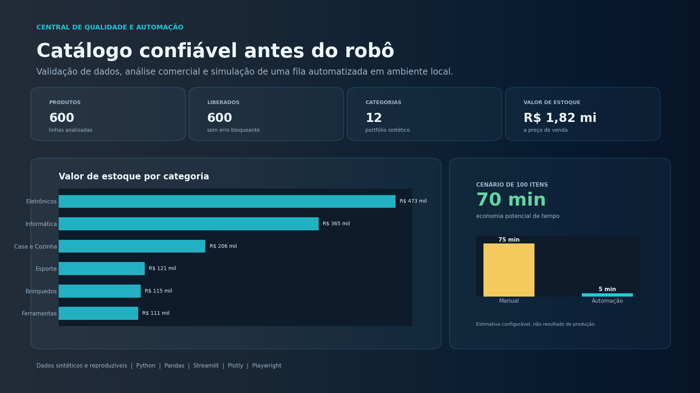
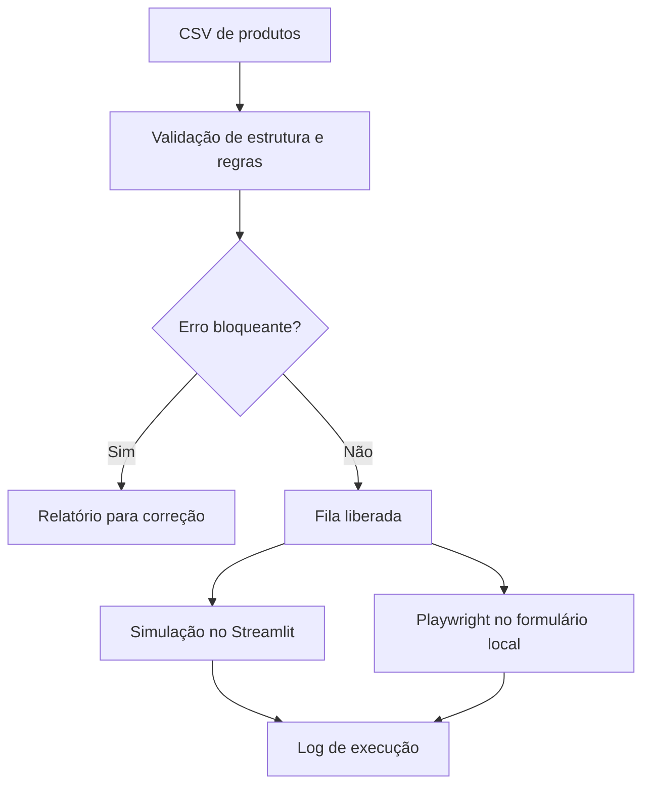

<div align="center">

# Central de Qualidade e Automação de Catálogo

### Validação de dados antes da execução automatizada

[](https://www.python.org/)
[](https://streamlit.io/)
[](https://playwright.dev/python/)
[](tests/)
[](docs/dados-e-metodologia.md)
[](LICENSE)

Uma aplicação de portfólio que recebe um catálogo em CSV, aplica regras de qualidade, separa registros bloqueados e demonstra uma fila automatizada em ambiente local.

</div>



## O problema

Automatizar o preenchimento de um formulário sem validar os dados apenas transfere erros para outro sistema. Este projeto trata a automação como a última etapa de um processo controlado:

1. o catálogo é recebido e padronizado;
2. regras de negócio identificam erros e avisos;
3. somente linhas sem erro bloqueante entram na fila;
4. a execução pode ser simulada ou realizada em um formulário local;
5. cada item gera um log auditável.

O resultado é uma demonstração compreensível de **qualidade de dados, análise e automação segura**, sem acessar sistemas externos ou exigir credenciais reais.

## O que pode ser testado

| Área | O que entrega |
|---|---|
| Visão executiva | Volume, linhas liberadas, valor de estoque, margem e concentração por categoria |
| Qualidade dos dados | Score, erros, avisos, linha de origem e orientação de correção |
| Catálogo liberado | Filtros, análise de preço, custo, margem, estoque e exportação em CSV |
| Simulador | Comparação hipotética entre preenchimento manual e automatizado |
| Automação local | Cadastro com Playwright em uma página HTML incluída no projeto |

## Resultados da amostra principal

A base padrão é fictícia, reproduzível e gerada com semente fixa.

| Indicador | Resultado |
|---|---:|
| Produtos analisados | 600 |
| Categorias | 12 |
| Marcas fictícias | 14 |
| Linhas com erro bloqueante | 0 |
| Linhas liberadas | 600 |
| Linhas sinalizadas para revisão | 16 |
| Valor de estoque a preço de venda | R$ 1.821.926,51 |
| Margem bruta mediana | 43,9% |

No cenário configurado com 100 itens, 45 segundos por cadastro manual e 3 segundos por cadastro automatizado, a economia calculada é de **70 minutos**, ou **93,3%**. Esse número é uma estimativa configurável, não uma medição de produção.

## Arquitetura do fluxo



## Regras de qualidade

| Regra | Severidade | Decisão |
|---|---|---|
| Campo obrigatório vazio | Erro | Bloqueia a linha |
| Código fora do padrão `ABC-0001` | Erro | Bloqueia a linha |
| Código duplicado | Erro | Bloqueia todas as ocorrências |
| Preço, custo ou estoque inválido | Erro | Bloqueia a linha |
| Custo superior ao preço | Erro | Bloqueia a linha |
| Margem bruta inferior a 20% | Aviso | Libera, mas recomenda revisão |
| Preço acima do padrão da categoria | Aviso | Libera, mas recomenda revisão |

O preço fora do padrão é identificado pelo intervalo interquartil dentro de cada categoria. As regras e suas limitações estão detalhadas em [dados e metodologia](docs/dados-e-metodologia.md).

## Tecnologias

- **Python e Pandas:** geração, leitura, validação e transformação dos dados;
- **Streamlit:** aplicação interativa e exportação dos resultados;
- **Plotly:** visualizações e filtros no painel;
- **Playwright:** preenchimento do formulário por seletores estáveis;
- **Pytest:** testes de dados, validação, segurança e contrato do HTML;
- **Matplotlib:** geração das imagens estáticas do repositório.

## Como executar o painel

### 1. Clone e entre na pasta

```bash
git clone https://github.com/bruno-dsn/Automacao-de-Tarefas.git
cd Automacao-de-Tarefas
```

### 2. Crie o ambiente com Python 3.14

```bash
python3.14 -m venv .venv
source .venv/bin/activate
python -m pip install --upgrade pip
python -m pip install -r requirements.txt
```

As versões foram fixadas em releases com suporte ao Python 3.14. Se o `pip` ainda tentar compilar o Pillow em vez de baixar o arquivo pronto para macOS, execute:

```bash
python -m pip install --upgrade pip
python -m pip install --only-binary=:all: pillow==12.3.0
python -m pip install -r requirements.txt
```

### 3. Abra a aplicação

```bash
python -m streamlit run app.py
```

O painel também aceita um CSV próprio. Use [data/catalogo_sintetico.csv](data/catalogo_sintetico.csv) como modelo de estrutura.

## Como testar a automação local

Instale os componentes adicionais:

```bash
python -m pip install -r requirements-automation.txt
python -m playwright install chromium
```

Abra dois terminais na raiz do projeto.

**Terminal 1: servir o formulário local**

```bash
python -m http.server 8000 --directory demo
```

**Terminal 2: validar e cadastrar dez itens**

```bash
python run.py --modo executar --limite 10
```

O navegador abre `http://127.0.0.1:8000/formulario.html`, preenche os campos e salva o resultado em `data/log_execucao.csv`.

Por segurança, destinos externos são bloqueados por padrão. Leia [automação segura](docs/automacao-segura.md) antes de adaptar os seletores.

## Uso pela linha de comando

```bash
# Apenas validar o arquivo
python run.py --modo validar

# Produzir um log fictício, sem navegador
python run.py --modo simular --limite 100

# Executar no formulário local
python run.py --modo executar --limite 10 --headless
```

## Testes

```bash
python -m pip install -r requirements-dev.txt
python -m pytest -q
```

Os testes cobrem:

- reprodução da base sintética;
- detecção de erros intencionais;
- cálculo de indicadores e tempo;
- reprodução do log simulado;
- bloqueio de URL externa;
- correspondência entre seletores do robô e campos do HTML.

## Estrutura do projeto

```text
.
├── app.py                         # aplicação Streamlit
├── run.py                         # validação, simulação e execução por CLI
├── data/                          # bases sintéticas incluídas
├── demo/formulario.html           # destino local da automação
├── src/
│   ├── analytics.py               # indicadores e agrupamentos
│   ├── browser_bot.py             # Playwright e política de URL
│   ├── data.py                    # geração de dados reproduzíveis
│   ├── execution.py               # log fictício da simulação
│   └── validation.py              # regras de qualidade
├── tests/                         # testes automatizados
├── scripts/                       # geração de dados e imagens
├── assets/                        # painel e capa para divulgação
└── docs/                          # decisões, dados e segurança
```

## Decisões técnicas

- **Seletores no lugar de coordenadas:** `data-testid` é mais legível e resistente a mudanças de resolução.
- **Duas severidades:** erro bloqueia; aviso pede análise humana.
- **Ambiente local por padrão:** a demonstração não depende de login ou sistema de terceiros.
- **Dados sintéticos identificados:** os números são úteis para estudo, sem aparentar ser informação empresarial real.
- **Simulação separada da execução:** o painel publicado não afirma ter automatizado um processo produtivo.

Mais detalhes estão em [decisões do projeto](docs/decisoes-do-projeto.md).

## Limitações

- O catálogo representa um cenário educacional e não contém dados reais de varejo.
- As regras de margem e outlier devem ser calibradas para cada negócio.
- A estimativa de tempo depende dos valores escolhidos pelo usuário.
- O formulário HTML é uma prova de conceito local, não um sistema comercial.
- Uma integração real exigiria autorização, homologação, observabilidade, controle de acesso e tratamento de limites do sistema de destino.

## Autor

**Bruno Nunes**
Cientista de Dados em formação pela Pós-Tech AI Scientist da FIAP.

[GitHub](https://github.com/bruno-dsn) | [LinkedIn](https://www.linkedin.com/in/bruno-dsnunes/)

---

Se este projeto ajudou você a pensar em automação com qualidade de dados, deixe uma estrela no repositório.
